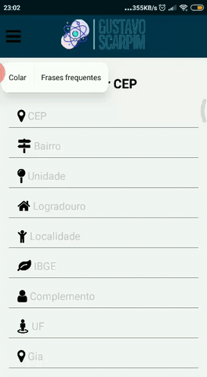

# Projeto para consulta de endereço pelo CEP com React Native.

Afins de estudos eu (Gustavo Scarpim) resolvi desenvolver uma aplicação simples em React Native, essa aplicação faz o uso de uma API para consultar CEPs válidos, e com essa API eu faço o tratamento dentro da minha aplicação para utiliza-lá.

Essa aplicação demonstra de forma simples e objetiva uma criação de Menu Drawer, e renderização de componentes!

# API VIA CEP:
https://viacep.com.br/ws/00000000/json/
[00000000] = CEP

## Iniciar Projeto

<b>Utilizando o Expo</b>

<b>1º Baixe o aplicativo Expo no seu celular</b>

<b>2º Clone esse repositório no seu computador ou baixe no formato (ZIP).</b>

<b>3º Abra o projeto em seu editor favorito.</b>

<b>4º Rode o comando "NPM INSTALL" ou "YARN INSTALL" para baixar todas as depêndencias do projeto.</b>

<b>5º Rode o comando "NPM START" para inicializar o projeto, em seguida, escaneie o código QR para ter a visualização do projeto em seu celular ou tablet</b>

# Desenvolvido por Gustavo Scarpim:

